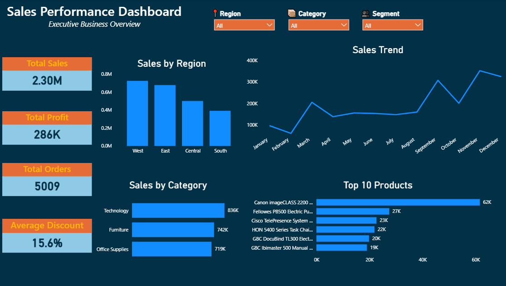

# Sales Performance Dashboard

## Project Overview

This project focuses on analyzing sales performance through an interactive Power BI dashboard. The objective is to transform raw sales data into meaningful business insights by identifying market trends, profitable regions, top-selling products, and key opportunities for strategic decision-making.

## Objective

Analyze sales performance using Power BI to identify:

- Market trends and sales patterns
- Most profitable regions
- Top-performing products
- Revenue and profitability opportunities
- Key business indicators through interactive visualization

## Tools Used

- Microsoft Power BI
- Data Modeling
- Data Transformation
- DAX Measures
- Data Visualization
- Business Intelligence

## Dashboard Preview

## Key Insights

- Identified the regions generating the highest sales contribution.
- Analyzed product performance to determine top-selling categories.
- Evaluated profitability trends to understand business performance.
- Created interactive visuals to support executive-level analysis.

## Business Recommendations

- Focus strategies on high-performing regions and products.
- Analyze low-performing areas to identify improvement opportunities.
- Use profitability insights to optimize sales strategies.
- Monitor key performance indicators regularly to support data-driven decisions.

- ## Project Files

- Power BI Dashboard: `Sales_Performance_Dashboard.pbix`
- Executive Summary: `Sales_Performance_Executive_Summary.pdf`
- Dashboard Preview: `Dashboard_Preview.png`

## Project Information

| Category | Details |
|---|---|
| Tool | Microsoft Power BI |
| Project Type | Business Intelligence / Data Analytics |
| Dataset | Sales Performance Dataset |
| Skills | Data Cleaning, Data Modeling, DAX, Dashboard Design |
| Status | Completed |
